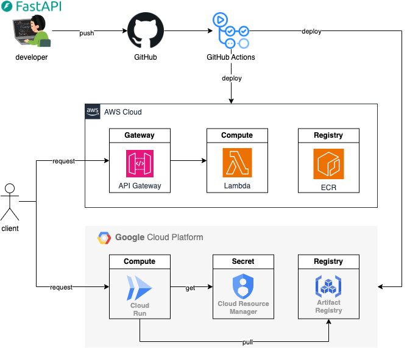
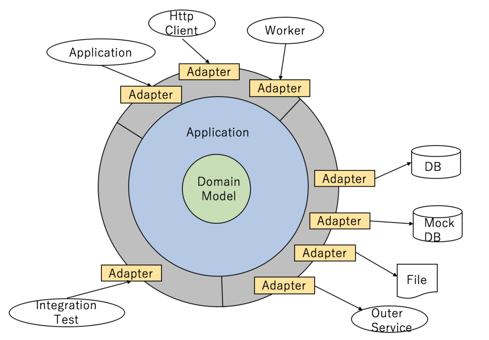

# Clean Architecture
This API template designed with DDD and Clean Architecture using FastAPI.

With this template, I implemented a system that provides role-based secure access management service for users.

 - python 3.12
 - [fastapi](https://pypi.org/project/fastapi/)
 - [pytest](https://pypi.org/project/pytest/)
 - [SQLAlchemy](https://pypi.org/project/SQLAlchemy/)

```bash
git clone https://github.com/gtaiyou24/clean-architecture $YOUR_SYSTEM_NAME

# replace 'clean-architecture' to your system name
grep 'clean-architecture' -rl * --exclude=README.md --exclude-dir=venv | xargs sed -i "s/clean-architecture/${YOUR_SYSTEM_NAME}/g"
grep 'clean-architecture' -rl .* --exclude-dir={.idea,.git} | xargs sed -i "s/clean-architecture/${YOUR_SYSTEM_NAME}/g"
```

## 🛠 Architecture
### 🛠 Infra



### 🛠 Application



> refer : https://buildersbox.corp-sansan.com/entry/2019/07/10/110000


<details><summary>📁directory</summary>

```
app
├── application  # application layer
├── domain
│   └── model  # domain layer
├── exception  # exception class package
└── port
    └── adapter  # port/adapter layer
        ├── persistence
        ├── resource
        │   └── health
        │       └── health_resource.py
        └── service
```

</details>

## 📖How To
### 🏃 Start
```bash
docker-compose up --build
```
 - [Swagger UI](http://localhost:8000/docs)
 - [MailHog](http://0.0.0.0:8025/)

```bash
`mysql -h 127.0.0.1 -P 3306 -u user -p`
# Enter password: pass
```

### ✅ Test

```bash
pip install pytest pytest-env httpx
pytest -v ./test
```

## 🔗Appendix

 - [VaughnVernon/IDDD_Samples - github.com](https://github.com/VaughnVernon/IDDD_Samples)
 - [hafizn07/next-auth-v5-advanced-guide-2024 - github.com](https://github.com/hafizn07/next-auth-v5-advanced-guide-2024)
