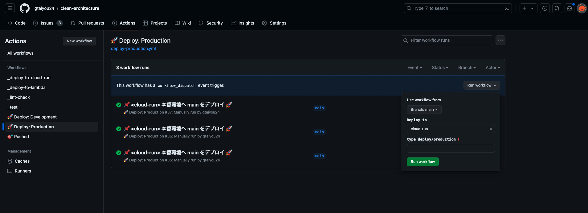

# GCP / Cloud Run


## 🏃 手順
### 💡 1. GCP API を有効にする
```bash
# Google Cloud SDK と Google アカウントを連携させる
gcloud auth login

# プロジェクトを確認
gcloud projects list

# プロジェクトを変更する
gcloud config set project ${PROJECT_ID}
```

以下のそれぞれのページにアクセスして、各 API を有効にしてください。

 - [Identity and Access Management (IAM) API](https://console.cloud.google.com/flows/enableapi?apiid=iam.googleapis.com&%3Bredirect=https%3A%2F%2Fconsole.cloud.google.com&hl=ja)
 - [Secret Manager API](https://console.cloud.google.com/marketplace/product/google/secretmanager.googleapis.com)
 - [Artifact Registry API](https://console.cloud.google.com/apis/library/artifactregistry.googleapis.com)
 - [Cloud Run Admin API](https://console.cloud.google.com/apis/library/run.googleapis.com)

```bash
# IAM API / Secret Manager API / Artifact Registry API を許可する
gcloud services enable \
  iamcredentials.googleapis.com \
  secretmanager.googleapis.com \
  artifactregistry.googleapis.com \
  run.googleapis.com \
  --project=${PROJECT_ID}
```

### ⚙️ 2. GitHub Actions のサービスアカウントを作成する

```bash
# サービスアカウントを作成
gcloud iam service-accounts create "github-actions"\
 --project=${PROJECT_ID} \
 --display-name="GitHub Actions サービスアカウント" \
 --description="GitHub Actions が GCP へアプリをデプロイするためのサービスアカウント"

# サービスアカウントが作成できたか確認
gcloud iam service-accounts list
```

GitHub Actions 経由でデプロイするために、本システムで以下のロールを利用します。そのため、予めサービスアカウントに以下のロールを付与します。

| ロール                                          | 説明                                    |
|:---------------------------------------------|:--------------------------------------|
| `roles/run.admin`                            | Cloud Run を設定し、デプロイするためのロール           |
| `roles/iam.serviceAccountUser`               | サービスアカウントのユーザーとしてのロール                 |
| `roles/artifactregistry.repoAdmin`           | Artifact Registry へのプッシュ、削除をするためのロール  |
| `roles/artifactregistry.createOnPushWriter`  | Artifact Registry にリポジトリを新規作成するためのロール |

```bash
gcloud projects add-iam-policy-binding ${PROJECT_ID} \
 --member="serviceAccount:github-actions@${PROJECT_ID}.iam.gserviceaccount.com" \
 --role="roles/run.admin"

gcloud projects add-iam-policy-binding ${PROJECT_ID} \
 --member="serviceAccount:github-actions@${PROJECT_ID}.iam.gserviceaccount.com" \
 --role="roles/iam.serviceAccountUser"

gcloud projects add-iam-policy-binding ${PROJECT_ID} \
 --member="serviceAccount:github-actions@${PROJECT_ID}.iam.gserviceaccount.com" \
 --role="roles/artifactregistry.repoAdmin"
 
gcloud projects add-iam-policy-binding ${PROJECT_ID} \
 --member="serviceAccount:github-actions@${PROJECT_ID}.iam.gserviceaccount.com" \
 --role="roles/artifactregistry.createOnPushWriter"
```

### 🛠️ 3. Workload Identity プール・プロバイダを作成する
GitHub Actions 経由で Cloud Run へデプロイするには、 Workload Identity プールと Workload Identity プロバイダを作成して Workload Identity 連携を設定および構成する必要があります。

```bash
# Workload Identity プールを作成
gcloud iam workload-identity-pools create "github-actions-pool" \
  --project="${PROJECT_ID}" \
  --location="global" \
  --display-name="GitHub Actions プール"

# Workload Identity プロバイダを作成
gcloud iam workload-identity-pools providers create-oidc "github-actions-provider" \
  --project="${PROJECT_ID}" \
  --location="global" \
  --workload-identity-pool="github-actions-pool" \
  --display-name="GitHub Actions Provider" \
  --attribute-mapping="google.subject=assertion.sub,attribute.repository=assertion.repository,attribute.actor=assertion.actor" \
  --issuer-uri="https://token.actions.githubusercontent.com"
```


### 👌 4. Workload Identity プロバイダが該当のサービスアカウントの権限を借用することを許可する
最後に、Workload Identity プロバイダからの認証について、目的のサービスアカウントの権限の借用を許可します。

```bash
# サービスアカウントの権限の借用を許可
gcloud iam service-accounts add-iam-policy-binding "github-actions@${PROJECT_ID}.iam.gserviceaccount.com" \
  --project="${PROJECT_ID}" \
  --role="roles/iam.workloadIdentityUser" \
  --member="principalSet://iam.googleapis.com/projects/${PROJECT_NUMBER}/locations/global/workloadIdentityPools/github-actions-pool/attribute.repository/${GITHUB_REPO_OWNER}/${GITHUB_REPO_NAME}"
```

### ⚙️ 5. Cloud Run サービスのサービスアカウントを作成する

```bash
# Cloud Run サービスアカウントを作成
gcloud iam service-accounts create ${CLOUD_RUN_SERVICE_ACCOUNT}\
 --project=${PROJECT_ID} \
 --display-name="${CLOUD_RUN_SERVICE_ACCOUNT} サービスアカウント" \
 --description="${CLOUD_RUN_SERVICE_ACCOUNT} のサービスアカウント"

# サービスアカウントが作成できたか確認
gcloud iam service-accounts list
```

Cloud Run のデプロイに必要なロールを付与する
```bash
# サービスアカウントユーザー
gcloud projects add-iam-policy-binding ${PROJECT_ID} \
 --member="serviceAccount:${CLOUD_RUN_SERVICE_ACCOUNT}@${PROJECT_ID}.iam.gserviceaccount.com" \
 --role="roles/iam.serviceAccountUser"
 
# Secret Manager アクセス権限
gcloud projects add-iam-policy-binding ${PROJECT_ID} \
 --member="serviceAccount:${CLOUD_RUN_SERVICE_ACCOUNT}@${PROJECT_ID}.iam.gserviceaccount.com" \
 --role="roles/secretmanager.secretAccessor"

# Cloud Run の管理者権限
gcloud projects add-iam-policy-binding ${PROJECT_ID} \
 --member="serviceAccount:${CLOUD_RUN_SERVICE_ACCOUNT}@${PROJECT_ID}.iam.gserviceaccount.com" \
 --role="roles/run.admin"
```

### 📝 6. GitHub Actions の Variable に GCP 情報を保存する
※もしくは直接 `.github/workflows` 以下の YAML ファイルに書き込む

|            変数             | 説明                      | 例                                                                                               |
|:-------------------------:|:------------------------|:------------------------------------------------------------------------------------------------|
|    `GCP_WIF_PROVIDER`     | Workload Identity プロバイダ | `projects/${PROJECT_NUMBER}/locations/global/workloadIdentityPools/<プールID>/providers/<プロバイダID>` <br>・例) プールID : github-actions-pool <br>・例) プロバイダID: github-actions-provider |
| `GCP_WIF_SERVICE_ACCOUNT` | サービスアカウント               | `github-actions@${PROJECT_ID}.iam.gserviceaccount.com`                                          |
|     `GCP_PROJECT_ID`      | プロジェクトID                | `clean-architecture`                                                                            |
| `GCP_CLOUD_RUN_SERVICE_ACCOUNT` | Cloud Run のサービスアカウント | `${CLOUD_RUN_SERVICE_ACCOUNT}@${PROJECT_ID}.iam.gserviceaccount.com`                            |

### 🔑 7. GitHub Actions が Secret Manager からクレデンシャル情報を取得できるようにする
データベースのパスワードや JWT で利用するキーなどのクレデンシャル情報を Secret Manager に保存しておきます。

[Secret Manager – Google Cloud コンソール](https://console.cloud.google.com/security/secret-manager?hl=ja)

| キー | 値                                         |
|:----|:------------------------------------------|
| `DATABASE_URL` | SQLAlchemy の `create_engine` の引数に指定する URL |
| `JWT_SECRET_KEY` | `jose.jwt` のエンコーディング・でコーディングで指定するキー |

### 🚀 8. GitHub の Actions からリリース


